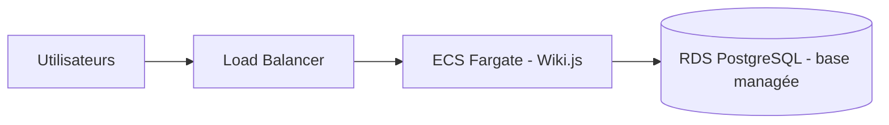

# Projet Cloud : Wiki.js + PostgreSQL

## Binôme
- Louis Pasqualini
- Mehdi Joyeux Kaboudi

## Scénario
Scénario A : le wiki **Wiki.js** avec une base de données **PostgreSQL**.

Services :
- **db** : base PostgreSQL (non accessible depuis l'extérieur)
- **wiki** : l'application Wiki.js
- **init** : crée l'admin et les pages au premier lancement, puis s'arrête
- **adminer** : interface pour voir la base (bonus)

## Lancer le projet
```bash
git clone https://github.com/Pasqua25/projet-cloud-wikijs.git
cd projet-cloud-wikijs
docker compose up -d
```
Attendre 1 à 2 minutes au premier lancement.

## Tester
- Wiki : http://localhost:8080
- Connexion admin : `admin@example.com` / `AdminWiki2026`
- Pages créées automatiquement : Accueil, Guide, FAQ
- Adminer (bonus) : http://localhost:8081 (serveur `db`, utilisateur `wikijs`, mot de passe `MotDePasseBDD2026`)

## Initialisation
Le conteneur `init` (script `init/init.sh`) attend que Wiki.js démarre, crée le compte admin, puis ajoute 3 pages. S'il a déjà été fait, il ne refait rien.

## Persistance
Le volume **`db_data`** garde les données de PostgreSQL en dehors du conteneur. Si on redémarre ou supprime les conteneurs, les pages et les comptes ne sont pas perdus.

## Bonnes pratiques
1. Les mots de passe sont dans le fichier `.env` (mots de passe de test, laissés dans le dépôt pour que le projet se lance sans modification).
2. La base de données n'a aucun port ouvert : seul Wiki.js peut y accéder, par le réseau interne de Docker.
3. PostgreSQL utilise une image légère (alpine).

## Architecture sur AWS

