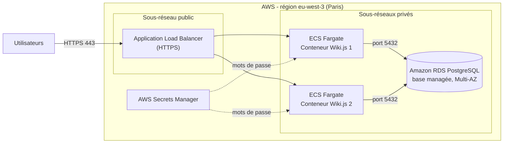

# Projet Cloud : Wiki.js + PostgreSQL avec Docker Compose

## Binôme
- Louis Pasqualini
- Mehdi Joyeux Kaboudi

## Scénario choisi
**Scénario A (application open-source)** : le wiki **Wiki.js** (conteneur web) couplé à une base **PostgreSQL** (conteneur base de données).

Le projet lance 4 services :

| Service | Rôle | Accès |
|---|---|---|
| `db` | Base PostgreSQL (image légère alpine) | Réseau interne uniquement |
| `wiki` | Application Wiki.js | http://localhost:8080 |
| `init` | Conteneur éphémère : crée l'admin et les pages au premier lancement, puis s'arrête | — |
| `adminer` | Interface web pour consulter la base (bonus) | http://localhost:8081 |

## Lancer le projet

Prérequis : Docker et Docker Compose installés.

```bash
git clone https://github.com/Pasqua25/projet-cloud-wikijs.git
cd projet-cloud-wikijs
docker compose up -d
```

Le premier démarrage prend 1 à 2 minutes (installation de Wiki.js et initialisation).

Vérifier que les services tournent :
```bash
docker compose ps
```

Suivre l'initialisation :
```bash
docker compose logs init
```
Le message `Initialisation terminée.` confirme que l'admin et les pages ont été créés.

## Tester

1. Ouvrir **http://localhost:8080** : le wiki s'affiche avec la page d'accueil.
2. Se connecter en administrateur :
   - E-mail : `admin@example.com`
   - Mot de passe : `AdminWiki2026`
3. Vérifier les 3 pages créées automatiquement : `/home`, `/guide`, `/faq`.
4. (Bonus) Ouvrir **http://localhost:8081** (Adminer) :
   - Système : PostgreSQL, Serveur : `db`
   - Utilisateur : `wikijs`, Mot de passe : `MotDePasseBDD2026`, Base : `wikijs`
   - Les tables `users` et `pages` contiennent les données initiales.

> Si le projet tourne dans une machine virtuelle en mode NAT, ouvrir le navigateur **dans la VM** : `localhost` désigne toujours la machine depuis laquelle on tape l'adresse.

## Initialisation automatique

Wiki.js crée lui-même ses tables au démarrage : un simple `init.sql` exécuté par PostgreSQL arriverait **trop tôt** (tables inexistantes). Nous utilisons donc un **conteneur éphémère d'initialisation** (`init`, script `init/init.sh`) qui :

1. attend que Wiki.js soit démarré ;
2. vérifie si l'initialisation a déjà été faite (dans ce cas, il ne fait rien : pas de doublons) ;
3. remplit l'assistant d'installation de Wiki.js, ce qui crée le **compte administrateur** ;
4. se connecte en administrateur via l'API GraphQL et crée le **jeu de données initial** (3 pages) ;
5. s'arrête.

## Persistance des données

Un volume Docker nommé **`db_data`** est monté sur `/var/lib/postgresql/data`, le dossier où PostgreSQL stocke ses fichiers.

**Pourquoi :** un conteneur est jetable. Sans volume, toutes les données (pages, utilisateurs, réglages) seraient perdues à la suppression du conteneur. Le volume est stocké en dehors du conteneur, sur l'hôte : les données survivent aux redémarrages et aux recréations.

Wiki.js stocke **tout** son contenu dans PostgreSQL : un seul volume suffit.

Test de persistance :
```bash
docker compose down      # supprime les conteneurs, garde le volume
docker compose up -d     # les pages et l'admin sont toujours là
```
Pour repartir de zéro (supprime aussi le volume) :
```bash
docker compose down -v
```

## Bonnes pratiques implémentées

1. **Secrets dans des variables d'environnement** : mots de passe et identifiants sont dans le fichier `.env`, jamais écrits en dur dans le `docker-compose.yml`.
   *Note : le `.env` est volontairement versionné avec des mots de passe de test pour que le projet se lance sans modification. En production, il serait exclu du dépôt (`.gitignore`) et remplacé par un gestionnaire de secrets (ex. AWS Secrets Manager).*
2. **Base de données non exposée** : le service `db` n'a aucun port publié sur l'hôte. Il n'est joignable que par les autres conteneurs, via le réseau interne créé par Compose, en utilisant le nom de service `db`.
3. **Image légère et démarrage ordonné** : PostgreSQL utilise l'image `alpine`. Un `healthcheck` sur la base, combiné à `depends_on: condition: service_healthy`, garantit que Wiki.js ne démarre que lorsque la base est prête.

## Architecture de déploiement sur AWS

En production, l'application serait déployée ainsi sur AWS (région Paris, `eu-west-3`) :



| En local (Docker Compose) | En production (AWS) |
|---|---|
| Port 8080 de l'hôte | **Application Load Balancer** : point d'entrée unique, répartit la charge |
| Conteneur `wiki` | **ECS Fargate** : exécute les conteneurs sans gérer de serveurs, plusieurs instances pour la haute disponibilité |
| Conteneur `db` + volume `db_data` | **Amazon RDS PostgreSQL** : base **managée** (sauvegardes, mises à jour et réplication gérées par AWS) |
| Fichier `.env` | **AWS Secrets Manager** : stockage sécurisé des mots de passe |
| Réseau interne Compose | **Sous-réseaux privés** : la base et les conteneurs ne sont pas accessibles depuis Internet |

## Structure du dépôt

```
projet-cloud-wikijs/
├── docker-compose.yml   # Orchestration des 4 services
├── .env                 # Variables d'environnement (identifiants de test)
├── init/
│   └── init.sh          # Script d'initialisation (admin + pages)
└── README.md
```
